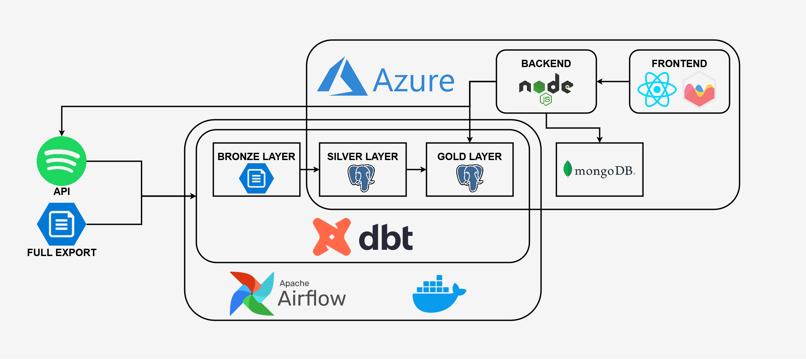

# **TrackTracker**

🎵 **TrackTracker** is a data-driven web application designed to provide users with detailed insights into their music listening habits. Built to showcase my expertise as a Data Engineer, TrackTracker seamlessly integrates real-time data processing, cloud storage with **Azure**, and advanced analytics to deliver a comprehensive view of musical preferences. By leveraging Azure's scalability and reliability alongside modern data engineering tools like **Airflow**, **DBT**, and **PostgreSQL**, the project exemplifies the power of cloud-based solutions in transforming raw data into actionable insights.

## **Features**

- **Current Listening History**: Real-time updates on a user’s recently played tracks.
- **Full Listening History**: Detailed analysis of a user’s complete listening data, enriched with visualizations and metrics.
- **Layered Data Architecture**: Bronze, Silver, and Gold layers ensure a structured approach to data processing and transformation.
- **Cloud-Optimized Data Model**: A dimensional star schema ensures efficient querying and analytics on cloud-hosted datasets.
- **Interactive Visualizations**: Insights at the track, artist, album, and user levels, made accessible through a user-friendly interface.

## **Architecture Overview**

TrackTracker employs a robust, scalable architecture designed with modern cloud platforms and data engineering best practices.

### **Key Components**

#### 1. **Data Sources**

- **Spotify API**: Provides real-time data on user listening habits.
- **Spotify Full Exports**: Processes historical listening data from user-provided JSON exports.

#### 2. **ETL Pipeline**

- **Apache Airflow**: Automates and orchestrates data ingestion workflows for consistent, reliable data updates.
- **DBT**: Handles data transformations, converting raw data into structured formats across **Bronze**, **Silver**, and **Gold** layers.
  - **Bronze Layer**: Raw data directly ingested from Spotify.
  - **Silver Layer**: Cleaned and enriched data, ready for analytics.
  - **Gold Layer**: Aggregated and analytics-ready datasets optimized for querying.

#### 3. **Cloud Data Storage**

- **Azure PostgreSQL**: Stores raw, transformed, and analytics-ready data, ensuring scalability and reliability for queries.
- **MongoDB (Azure)**: Manages user authentication and session information for secure backend operations.

#### 4. **Backend**

- **Node.js**: Processes API requests, manages Spotify authentication, and handles communication with the database.
- **Express.js**: Provides a RESTful interface for frontend interactions and API integrations.

#### 5. **Frontend**

- Built with **React.js**, the frontend provides an interactive, user-friendly interface.
- Displays current and historical listening trends through dynamic charts and visualizations with **Chart.js**.

## **Showcase**

### **Current History**

### **Full History**

## **Future Roadmap**

- [ ] **Live Deployment**: Make TrackTracker accessible to a global audience via Azure-hosted services.
- [ ] **Global Trends**: Aggregate data to showcase listening trends across users.
- [ ] **Multi-Platform Support**: Integrate other music streaming platforms (e.g., Apple Music, YouTube Music).
